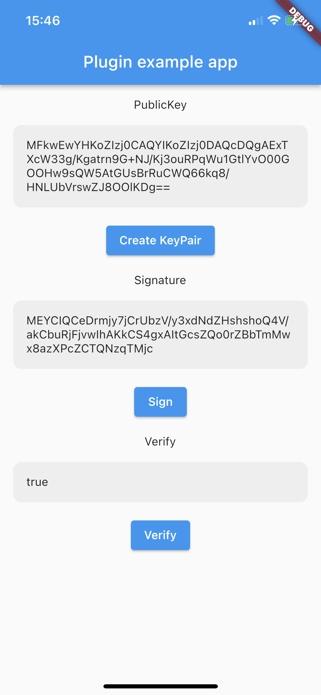

# local_auth_signature

[](https://pub.dartlang.org/packages/local_auth_signature)

Generate key pair and signing (NIST P-256 EC key pair using ECDSA) using Local Authentication for Android and iOS.



## Getting started

It is really easy to use! You should ensure that you add the `local_auth_signature` as a dependency in your flutter project.

```yaml
local_auth_signature: "^1.0.1"
```

## Usage

### Flutter

#### New instance

```dart
final _localAuthSignature = LocalAuthSignature.instance;
```

#### Define Key

```dart
final _key = 'com.prongbang.signx.key';
```

#### Create KeyPair

```dart
try {
    final publicKey = await _localAuthSignature.createKeyPair(
        _key,
        AndroidPromptInfo(
            title: 'BIOMETRIC',
            subtitle: 'Please allow biometric',
            negativeButton: 'CANCEL',
        ),
        IOSPromptInfo(reason: 'Please allow biometric'),
    );
    print('publicKey: $publicKey');
} on PlatformException catch (e) {
  print('PlatformException: ${e.code}');
}
```

#### Sign

```dart
final _payload = 'Hello';
try {
    final signature = await _localAuthSignature.sign(
        _key,
        _payload,
        AndroidPromptInfo(
            title: 'BIOMETRIC',
            subtitle: 'Please allow biometric',
            negativeButton: 'CANCEL',
        ),
        IOSPromptInfo(reason: 'Please allow biometric'),
    );
    print('signature: $signature');
} on PlatformException catch (e) {
  print('PlatformException: ${e.code}');
}
```

#### Verify

```dart
try {
    final verified = await _localAuthSignature.verify(
        _key,
        _payload,
        _signature!,
        AndroidPromptInfo(
            title: 'BIOMETRIC',
            subtitle: 'Please allow biometric',
            negativeButton: 'CANCEL',
        ),
        IOSPromptInfo(reason: 'Please allow biometric'),
    );
    print('verified: $verified');
} on PlatformException catch (e) {
    print('PlatformException: ${e.code}');
}
```

### Android

- Update code in `MainActivity.kt` file

```kotlin
import io.flutter.embedding.android.FlutterFragmentActivity

class MainActivity : FlutterFragmentActivity()
```

- Add use-permissions in `AndroidManifest.xml` file

```xml
<uses-permission android:name="android.permission.USE_BIOMETRIC" />
```

### iOS

- Add privacy in `info.plist` file

```xml
<dict>
  <key>NSFaceIDUsageDescription</key>
  <string>This application wants to access your TouchID or FaceID</string>
</dict>
```
